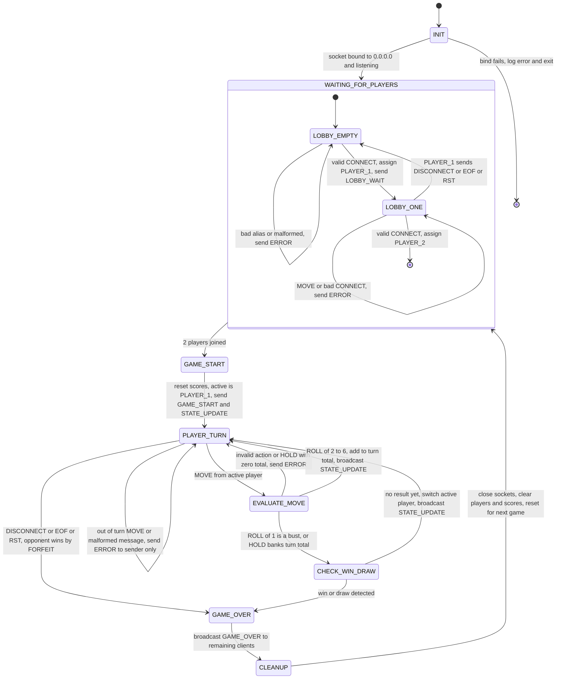
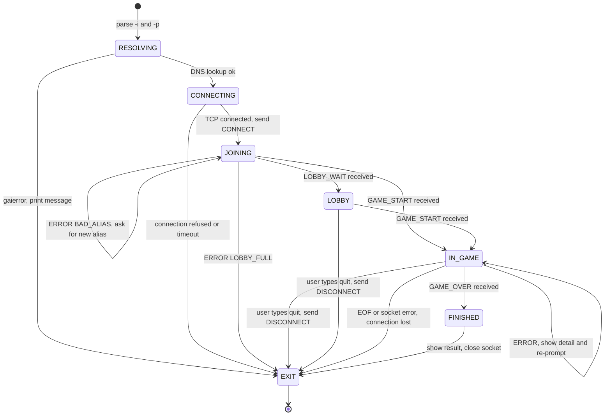

# Game State Machine (FSM) Specification — CLI Pig

**Project:** CS 457 Multiplayer Network Game
**Student:** Wade McCaulley
**Sprint:** 1 — Protocol & FSM Design
**Companion doc:** [`protocol_blueprint.md`](protocol_blueprint.md) — message formats referenced below

The server runs one game room. This FSM describes that room. The server is the only authority: it holds the state, rolls the die, and decides every transition. Clients just render what the server broadcasts.

---

## 1. Server FSM Diagram



A third client that connects in any state other than `WAITING_FOR_PLAYERS` gets `ERROR LOBBY_FULL` and is closed. It never touches room state, so it isn't drawn as a transition.

---

## 2. State Definitions

| State | What the server holds / does | Leaves when |
|---|---|---|
| `INIT` | Parse `-p`, create socket, `SO_REUSEADDR`, `bind(("0.0.0.0", port))`, `listen()`. | Bind succeeds → `WAITING_FOR_PLAYERS`. Bind fails (port in use, bad port) → log and exit cleanly. |
| `WAITING_FOR_PLAYERS` | Accept connections. Substates `LOBBY_EMPTY` (0 players) and `LOBBY_ONE` (Player 1 waiting). Roles assigned by join order. | Second valid `CONNECT` → `GAME_START`. |
| `GAME_START` | Set both scores to 0, `turn_total = 0`, `active_player = PLAYER_1`, `final_turn = False`. Send each client its own `GAME_START`, then broadcast a `TURN_START` `STATE_UPDATE`. | Immediately → `PLAYER_TURN`. |
| `PLAYER_TURN` | Waiting for the active player's `MOVE`. Both sockets are read; only the active player's `MOVE` advances the game. | Active `MOVE` → `EVALUATE_MOVE`. Either player leaves → `GAME_OVER` (forfeit). |
| `EVALUATE_MOVE` | Server rolls `random.randint(1, 6)` on `ROLL`, or banks on `HOLD`. | See Section 3. |
| `CHECK_WIN_DRAW` | Turn just ended (bust or hold). Apply the end-of-turn rules in Section 4. | Game continues → `PLAYER_TURN`. Result → `GAME_OVER`. |
| `GAME_OVER` | Build `GAME_OVER` (`WIN`, `DRAW`, or `FORFEIT`), send to every still-connected client. Each send is wrapped so one dead socket can't block the other. | After broadcast → `CLEANUP`. |
| `CLEANUP` | Close both sockets (ignore errors), clear player table, receive buffers, scores, flags. | Immediately → `WAITING_FOR_PLAYERS` (post-game reset — server is ready for a new pair without restarting). |

---

## 3. `EVALUATE_MOVE` Logic

```
if action not in ("ROLL", "HOLD"):
    send ERROR INVALID_ACTION                 → PLAYER_TURN (no change)

if action == "HOLD" and turn_total == 0:
    send ERROR INVALID_ACTION                 → PLAYER_TURN (no change)

if action == "ROLL":
    die = random.randint(1, 6)                # server-side only
    if die == 1:
        turn_total = 0
        last_event = BUSTED(die=1)            → CHECK_WIN_DRAW
    else:
        turn_total += die
        broadcast STATE_UPDATE ROLLED(die)    → PLAYER_TURN (same player rolls again or holds)

if action == "HOLD":
    scores[active] += turn_total
    last_event = HELD(points_banked=turn_total)
    turn_total = 0                            → CHECK_WIN_DRAW
```

---

## 4. `CHECK_WIN_DRAW` Logic — Last-Licks Rule

Classic Pig ends the instant someone reaches 100, which gives Player 1 (who moves first) an edge and makes a tie impossible. This project uses **last licks**: if Player 1 reaches 100, Player 2 gets exactly one final turn to match or beat it.

| # | Who just ended a turn | Condition | Result |
|---|---|---|---|
| 1 | `PLAYER_1` | `scores[P1] >= 100` | Set `final_turn = True`. Switch to `PLAYER_2`. Broadcast `STATE_UPDATE`. → `PLAYER_TURN` |
| 2 | `PLAYER_1` | `scores[P1] < 100` | Switch to `PLAYER_2`. → `PLAYER_TURN` |
| 3 | `PLAYER_2` | `final_turn` is `False` and `scores[P2] >= 100` | `WIN`, winner `PLAYER_2` (both have had equal turns). → `GAME_OVER` |
| 4 | `PLAYER_2` | `final_turn` is `False` and `scores[P2] < 100` | Switch to `PLAYER_1`. → `PLAYER_TURN` |
| 5 | `PLAYER_2` | `final_turn` is `True` and `scores[P2] > scores[P1]` | `WIN`, winner `PLAYER_2`. → `GAME_OVER` |
| 6 | `PLAYER_2` | `final_turn` is `True` and `scores[P2] == scores[P1]` | `DRAW`, winner `null`. → `GAME_OVER` |
| 7 | `PLAYER_2` | `final_turn` is `True` and `scores[P2] < scores[P1]` | `WIN`, winner `PLAYER_1` (includes busting on the final turn). → `GAME_OVER` |

Notes:
- Only banked points count. A turn total above 100 isn't a win until the player holds.
- On the final turn Player 2 chooses when to hold, so they can roll past Player 1's score — or hold at an exact tie if they'd rather take the draw than risk a bust.

---

## 5. Error Handling & Edge Cases

All of these are handled without leaving the current state (except disconnects) and without crashing the server loop. Message codes are defined in `protocol_blueprint.md` Section 4.6.

| Event | State(s) | Server action | Next state |
|---|---|---|---|
| `MOVE` from inactive player | `PLAYER_TURN` | `ERROR NOT_YOUR_TURN` to sender only | `PLAYER_TURN` |
| `action` not `ROLL`/`HOLD` | `EVALUATE_MOVE` | `ERROR INVALID_ACTION` | `PLAYER_TURN` |
| `HOLD` with turn total 0 | `EVALUATE_MOVE` | `ERROR INVALID_ACTION` | `PLAYER_TURN` |
| `player_id` doesn't match socket | any | `ERROR PLAYER_ID_MISMATCH` | unchanged |
| Not valid UTF-8 / JSON / envelope | any | `ERROR MALFORMED_MESSAGE` | unchanged |
| Unknown or server-only `msg_type` | any | `ERROR UNKNOWN_MSG_TYPE` | unchanged |
| `MOVE` before game starts | `WAITING_FOR_PLAYERS` | `ERROR GAME_NOT_STARTED` | unchanged |
| Second `CONNECT` on same socket | any | `ERROR ALREADY_CONNECTED` | unchanged |
| Third client connects | any after lobby fills | `ERROR LOBBY_FULL`, close that socket only | unchanged |
| 4096 bytes with no `\n` | any | `ERROR MESSAGE_TOO_LARGE`, close sender | treated as a disconnect for that player |
| Player 1 leaves while alone in lobby | `LOBBY_ONE` | Close socket, clear slot | `LOBBY_EMPTY` |
| Either player sends `DISCONNECT` mid-game | `PLAYER_TURN` | `GAME_OVER FORFEIT`, other player wins | `GAME_OVER` → `CLEANUP` |
| Either player EOF (`recv()` returns `b""`) mid-game | `PLAYER_TURN` | Same as above | `GAME_OVER` → `CLEANUP` |
| `ConnectionResetError` / `BrokenPipeError` / keepalive timeout mid-game | `PLAYER_TURN` | Same as above | `GAME_OVER` → `CLEANUP` |
| `sendall()` fails during a broadcast | any broadcast | Finish sending to the other client, then treat the failed one as disconnected | `GAME_OVER` (forfeit) if mid-game |
| Disconnect after `GAME_OVER` already sent | `GAME_OVER`, `CLEANUP` | Ignored | unchanged |

`EVALUATE_MOVE` and `CHECK_WIN_DRAW` run inside one locked block (see Section 7), so a disconnect can't land in the middle of them. The disconnect is processed as soon as the lock is released, from `PLAYER_TURN`. That's why the diagram only shows disconnect arrows out of `PLAYER_TURN` and the lobby.

---

## 6. Client FSM (for reference)

The client is a thin view. It never computes scores or decides turns; it only decides which prompt to show based on the last message from the server.



---

## 7. Concurrency Note (detailed in Sprint 3)

Plan from the SOW: one `threading.Thread` per client socket, each running the receive loop from `protocol_blueprint.md` Section 2.5. Room state (`state`, `players`, `scores`, `turn_total`, `active_player`, `final_turn`) is guarded by one `threading.Lock`. Every handler — `CONNECT`, `MOVE`, `DISCONNECT`, and `handle_disconnect` — takes the lock, applies one FSM transition, queues outbound messages, releases the lock, then sends. Sending outside the lock means a slow or dead client can't freeze the other player's thread.
